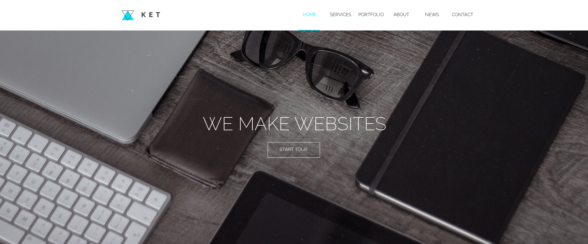
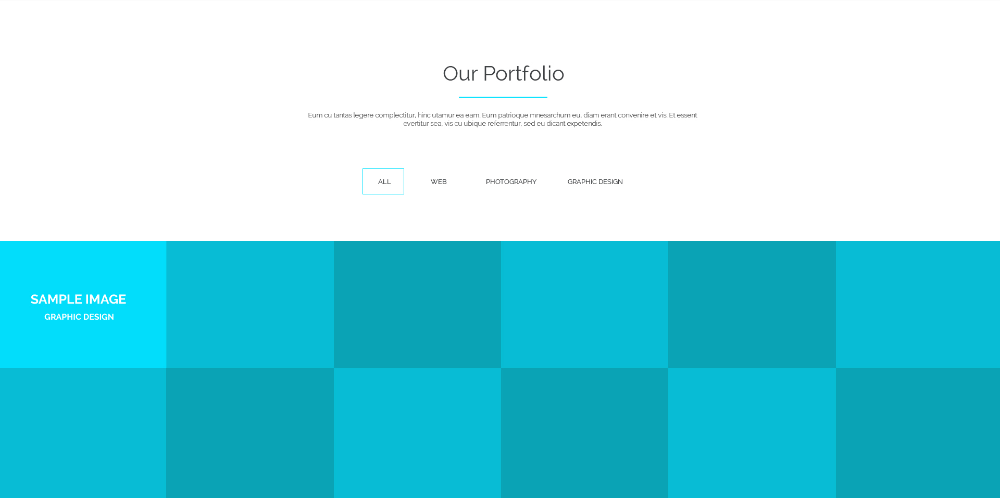
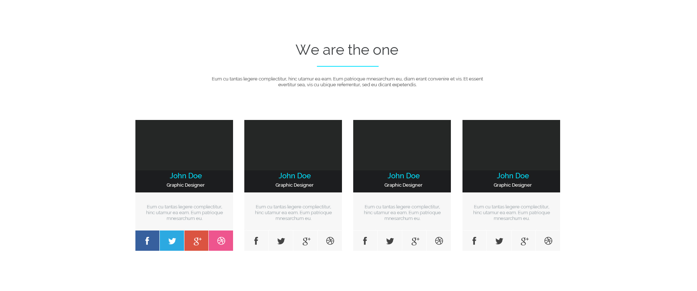

## Задача 
* Создание сайта-портфолио веб-студии по предоставленному psd макету. 

## Общие требования к сайту 
* Корректное отображение сайта на следующих разрешениях экрана: 320px, 768px, 992px, 1200 px 
* Поддержка браузеров: последние версии Chrome, Firefox, Safarі, Opera, MS Edge.
* Корректное отображение на iPhone6S, Galaxy Note4 (https://www.browserstack.com) 
* Для реализации функционала сайта используйте AngularJS. 
* Допускается использование сторонних модулей и библиотек.

## Структура сайта: 
### Header
  

* Меню дожно быть зафиксировано в верхней части экрана, чтобы пользователь мог им всегда воспользоватся. 
* При нажатии на каждый элемент меню страница плавно прокручивается до соответствующего блока. 
* При нажатии на кнопку start tour страница плавно прокручивается до блока портфолио.  
* Для реализации плавной прокрутки страницы напишите свой сервис AngularJS или используйте сторонние ресурсы(например, https://github.com/d-oliveros/ngSmoothScroll).

### Блок с описанием сервисов
 

* При клике по каждой из иконок сервисов открывается вкладка с текстом описания сервиса(для решения задачи используйте произвольный текст и директиву ng-switch). По умолчанию открыта первая вкладка. 
* При нажатии на кнопку get now страница плавно прокручивается до блока контактов. 

### Блок портфолио 

* Добавьте произвольные изображения в портфолио. 
* Реализуйте фильтрацию изображений по категориям(для решения задачи создайте фильтр AngularJS).  
* При наведении курсора мыши на изображение над ним появляется полупрозрачный слой с информацией о том к какой категории относится данное изображение. 

### Блок со статистикой достижений 

* Когда блок только появился в видимой области страницы, течении 3 секунд происходит отсчет от 0 до значений, указанных в макете.
* Для решения задачи используйте директиву AngularJS. 

### Блок about us 

* Добавьте произвольное фото для членов команды. 
* При наведении мыши на иконки ссылок социальных сетей они меняют цвет: 

* Реализуйте блок с помощью директивы. 

### Блок новостей 

* Загрузите описание новостей из JSON-файла(файл data.json в папке project). 
* Для отображения новостей на странице используйте директиву ng-repeat и одностороннюю привязку данных. 
* При нажатии на текст read more выполняется переход по пути '/id', где id - id новости. На открывшейся странице отображается дата и текст новости. 
* Маршрутизацию нужно реализовать без перезагрузки страницы. 

### Блок контактов 

* Форма с полями Name, Email, Message. Валидация формы происходит при нажатии на клавиши. При вводе пользователем некорректных данных в поле ввода под этим полем сразу отображается сообщение об ошибке. Сообщение об ошибке сразу же скрывается, если пользователь ввел корректные данные. 
* В поле Name допускаются только буквы английского алфавита.
* В поле Email допускаются толко буквы английского алфавита, цифры, знак подчеркивание, точка и симвом @. 
* В поле Message допускаются любые символы. Минимальная длина сообщения - 20 символов. 

### Footer
 

* Копирайт и кнопка вврех. 
* При нажатии на кнопку страница плавно прокручивается в начало. 

