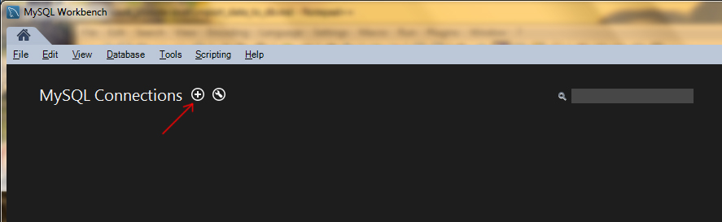
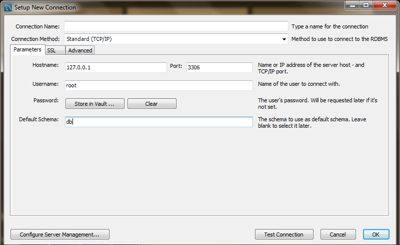
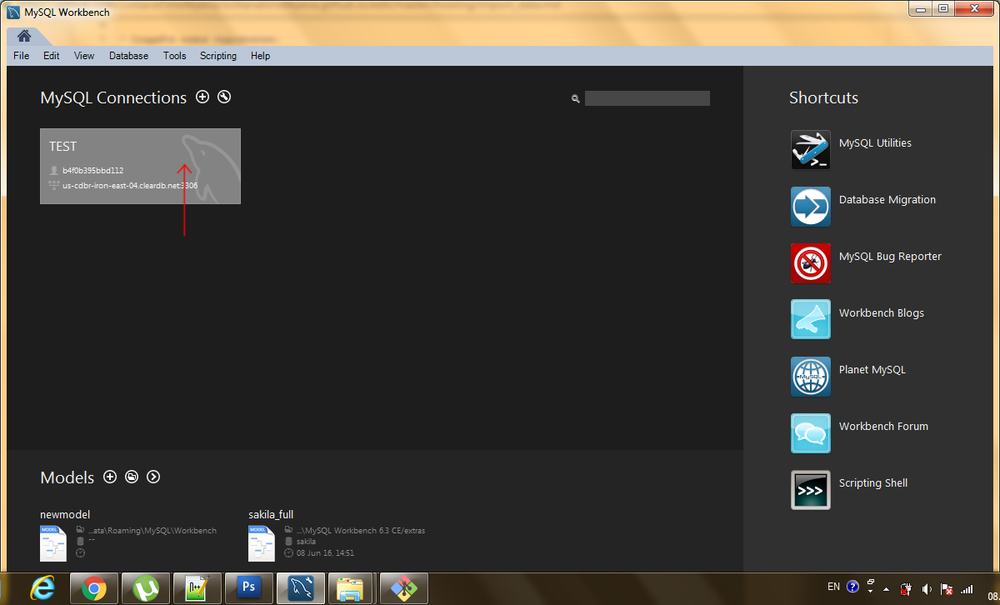
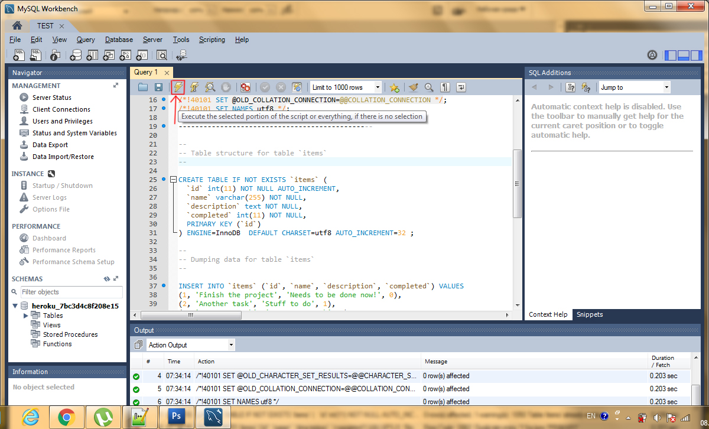

## Импорт данных в бд (с использованием утилиты MySQL Workbench) 

### Установите [MySQL Workbench](http://www.mysql.com/downloads/) 

### Установите соединение с бд

* Создайте новое подключение: 

* Настройте конфигурацию подключения

* После ввода данных (хост, порт, имя пользователя, пароль, имя базы данных) кликните по кнопке test connection. Если данные введены верно, на экран будет выведено сообщение об успешной установке соединения, затем нажмите ок. 

* Для работы с базой данных выберите настроенное соединение и кликните по нему.

* Скопируйте код sql скрипта в открывшееся окно. 
* Выполните sql запросы к бд:  

