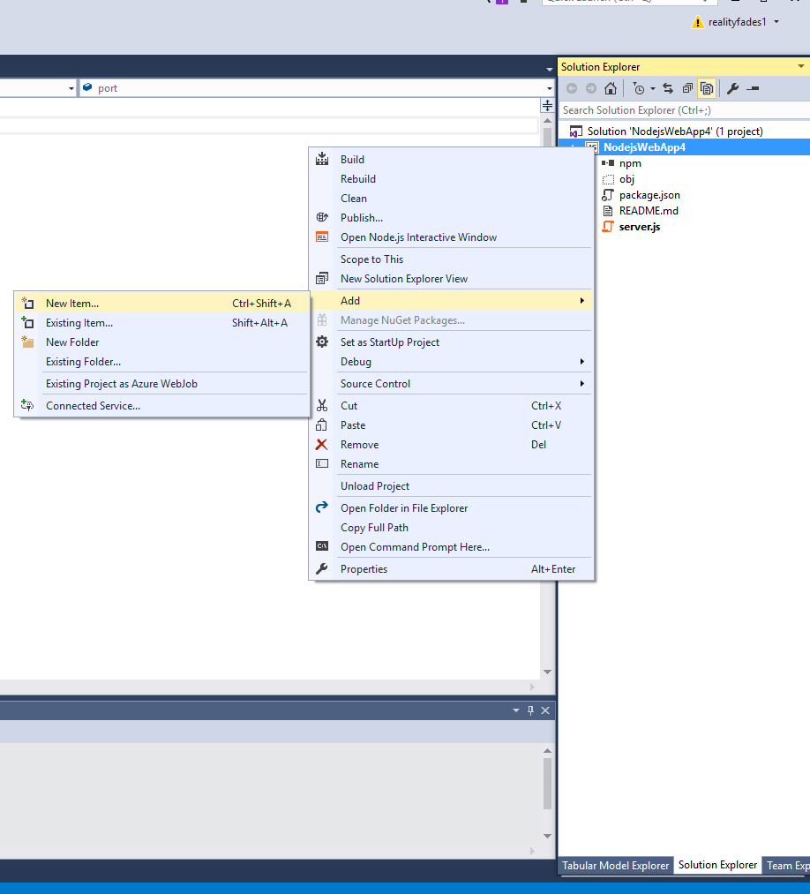
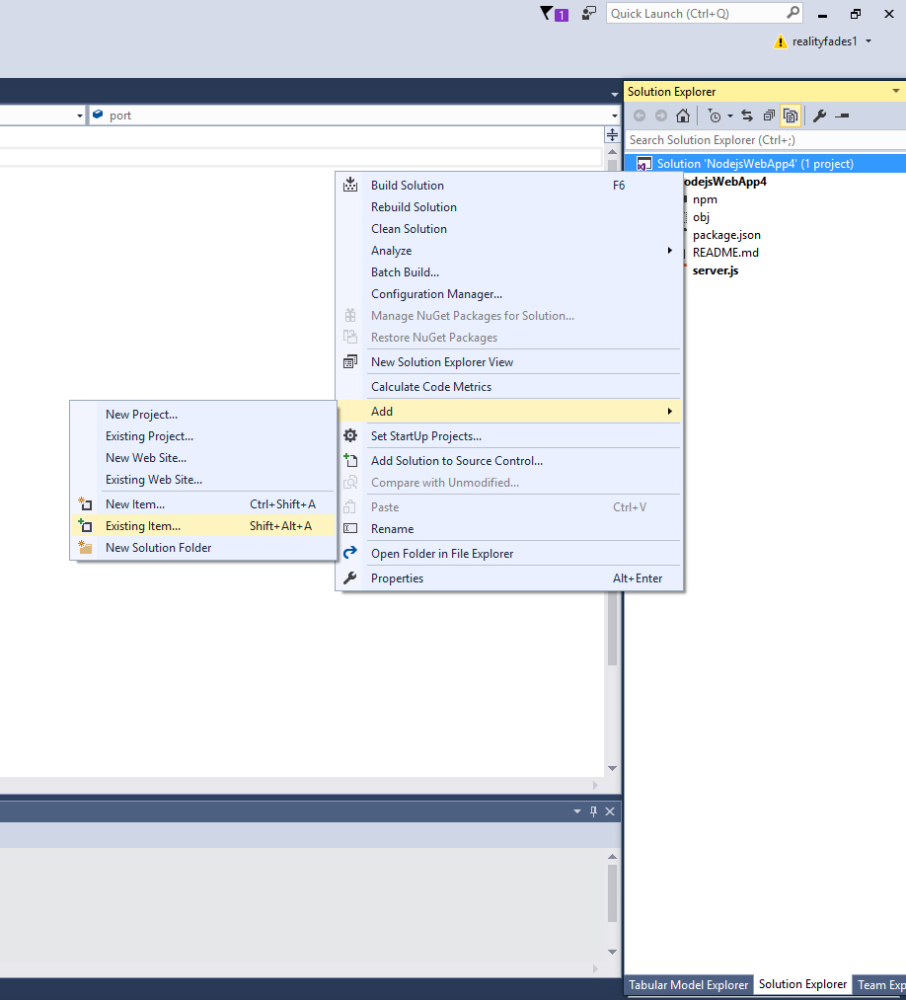

# Интеграция NodeJS в Visual Studio 2015  

### Убедитесь, что [NodeJS](https://nodejs.org/en/download/) установлен на вашем ПК. 

### Установите [Node Tools](https://www.visualstudio.com/en-us/features/node-js-vs.aspx) для Visual Studio. 

### Создайте новый проект NodeJS: 

* Выберите в меню следующие опции: File > New > Website 

  

* Выберите в открывшемся диалоговом окне базовое приложение NodeJS и нажмите Ок. 

* Для просмотра файлов проекта выберите в меню View > Solution Explorer. 

* Для создания нового файла в проекте NodeJS кликните правой кнопкой мыши по корню каталога проекта в Solution Explorer и выберите опции Add > New Item. 
  

* Для добавления уже существующих файлов в проект кликните правой кнопкой мыши по корню каталога проекта в Solution Explorer и выберите опции Add > Existing Item. В открывшемся диалоговом окне выберите нужные файлы и нажмите Ок для добавления их в проект. 
  

* Для запуска файла нажмите Ctrl + F5. Одновременно откроется терминал node.js и окно браузера. 
* Если вам не нужна функция автоматического запуска браузера при запуске кода NodeJS, уберите галочку напротив опции Enable Browser Link: 

  

