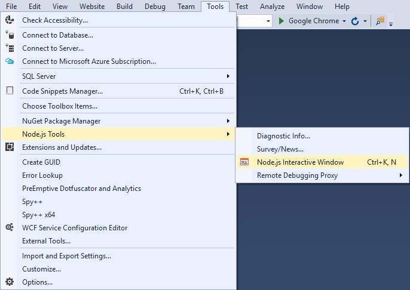
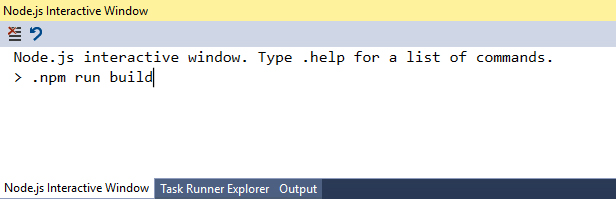

# Интеграция Browserify в Visual Studio 2015 

## Установка browserify 

```
$ npm install -g browserify 
``` 

## Установка VS расширения Node Tools 

[Node.js Tools 1.2 for Visual Studio 2015](https://visualstudiogallery.msdn.microsoft.com/68faf8ac-b953-42f5-a908-55555deccf7a)

## Интеграция browserify в Visual Studio 


* Файл package.json должен находится в директории с приложением 

* Для открытия приложения выберите в меню File > Open > Website и в открывшемся диалоговом окне выберите папку с вашим приложением. 

* Укажите в поле scripts файла package.json необходимые вам для работы команды browserify. Например: 

```
  "scripts": {
    "build": "browserify -t [ babelify --presets [ es2015 react ] ] ./src/main.jsx -o build/bundle.js",
    "watch": "watchify -t [ babelify --presets [ es2015 react ] ] ./src/main.jsx -o build/bundle.js", 
     "uglify": "browserify -t [ uglifyify ] ./build/bundle.js -o build/bundle.min.js"
  } 
``` 

* Откройте интерактивное окно для работы с node и npm: 

   

* Выполните нужную вам команду: 

   

* Обратите внимание, что команды в интерактивном окне Node Tools начинаются с '.' .То есть, нужно писать '.npm run' вместо 'npm run' и т.д. 
