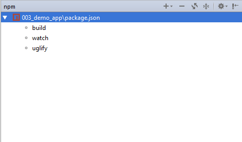
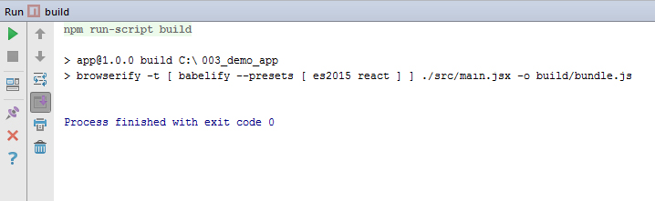

# Интеграция Browserify в WebStorm

## Установка browserify 
```
$ npm install -g browserify 
``` 

## Интеграция Browserify в WebStorm IDE 


* Файл package.json должен находится в директории с приложением 

* Укажите в поле scripts файла package.json необходимые вам для работы команды browserify. Например: 

```
  "scripts": {
    "build": "browserify -t [ babelify --presets [ es2015 react ] ] ./src/main.jsx -o build/bundle.js",
    "watch": "watchify -t [ babelify --presets [ es2015 react ] ] ./src/main.jsx -o build/bundle.js", 
	"uglify": "browserify -t [ uglifyify ] ./build/bundle.js -o build/bundle.min.js"
  } 
```  

* Перейдите в пункт меню View, выберите опцию Tool Windows > Project 
* В открывшемся окне с каталогом папок приложения кликните правой кнопкой мыши по файлу package.json и выберите опцию show npm scripts 


   

* В открывшемся диалоговом окне npm кликните два раза по нужной вам опции: 

   
 
* Следите за процессами browserify в открывшемся терминале: 

 

* Для запуска файла выберите файл и нажмите Ctrl+Shift+F10. 